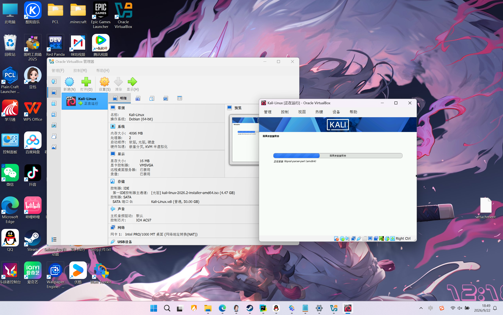
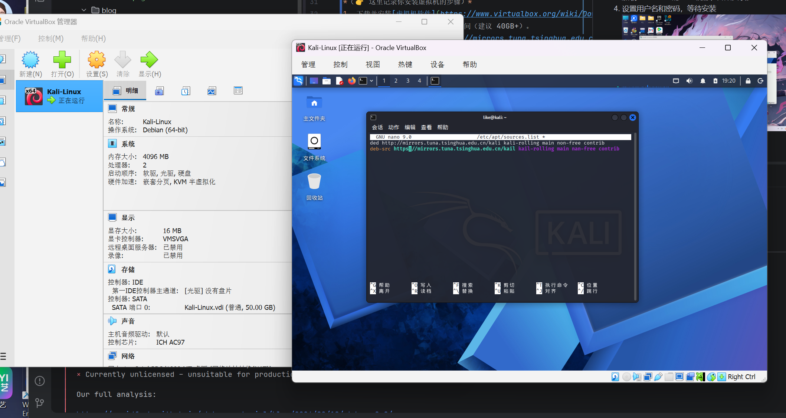
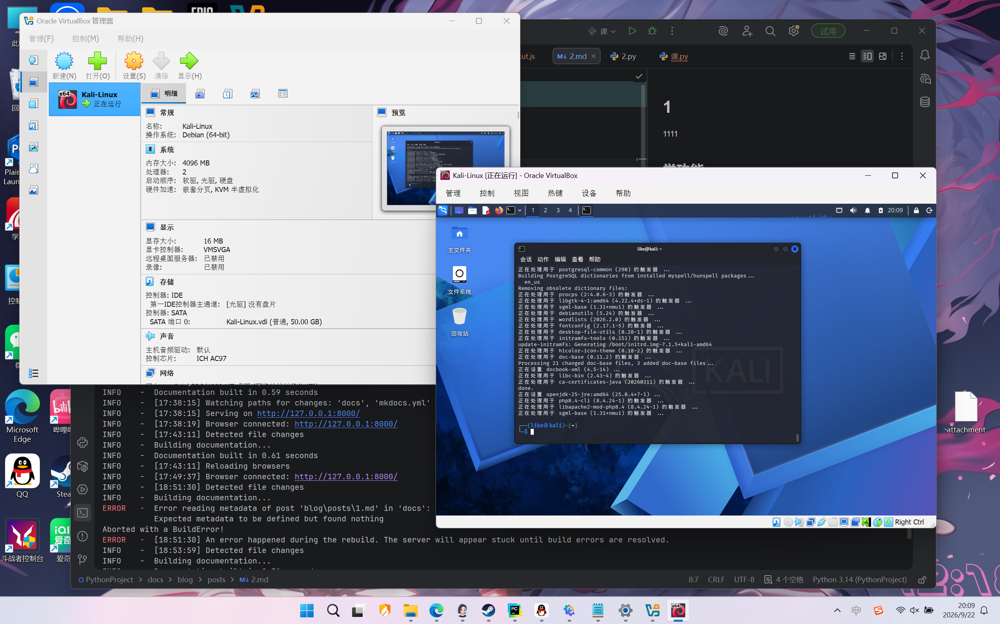

# 信息安全作业：等保2.0与Kali环境配置

## 第一部分：我对等保2.0的理解

### 1. 什么是等保2.0？
等保2.0（网络安全等级保护2.0）是我国网络安全领域的基本国策和基本制度。从PPT的“等级保护发展历程”可以看出，它历经了1994年、2006年、2009年、2016年等多个阶段的演进，最终在2019年正式实施《网络安全等级保护制度2.0》。

### 2. 等保2.0的核心变化
相比于等保1.0，等保2.0不仅扩大了保护对象（涵盖了云计算、物联网、移动互联、工业控制系统等），还提升了法律层级。PPT中提到的“在违法的边缘试探”这个梗图也说明了：**合规是底线，不能触碰法律红线**。

### 3. 关于等保评估中的“社会工程学”与“拒绝服务攻击”
在实际的等保测评中，系统不仅要防范技术漏洞，还要防范**社会工程学攻击**（如钓鱼邮件、欺骗诱导），同时也要具备应对**拒绝服务攻击（DDoS）**的防护能力。

---

## 第二部分：虚拟机安装与Kali配置

### 1. 环境准备
*   虚拟机软件：VirtualBox
*   Kali Linux 镜像：官网下载最新版

### 2. 安装虚拟机与Kali

1. 下载并安装[虚拟机软件](https://www.virtualbox.org/wiki/Downloads)

2. 新建虚拟机，分配了 4GB 内存，2 核 CPU，50GB 硬盘，存放于 D 盘。

3. 加载[ Kali Linux ](https://mirrors.tuna.tsinghua.edu.cn/kali-images/)的 ISO 镜像，开始安装。

4. 设置用户名和密码，等待安装

### 3. Kali 配置
1. 安装 VMware Tools。
2. 更新软件源，配置国内清华源，提高下载速度
   

3. 执行系统更新：`sudo apt update && sudo apt upgrade -y`。
   